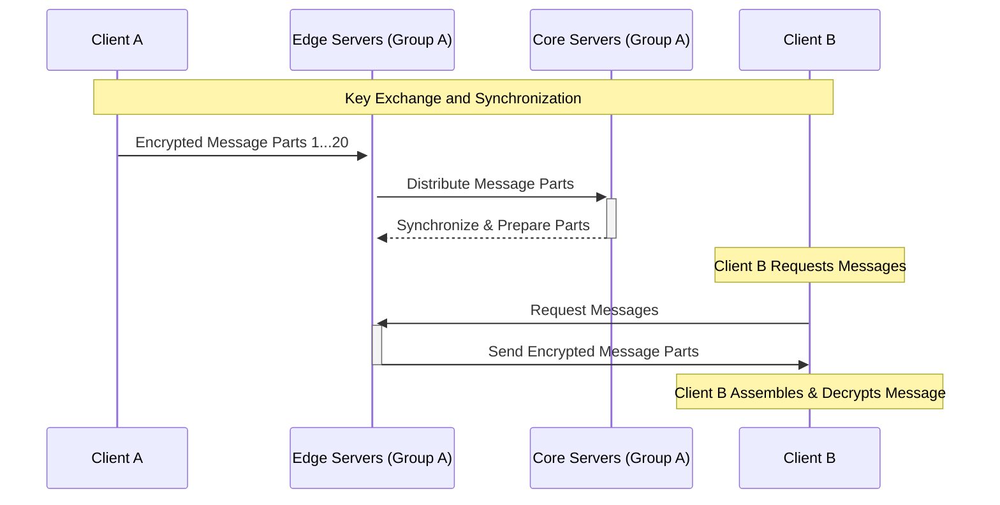
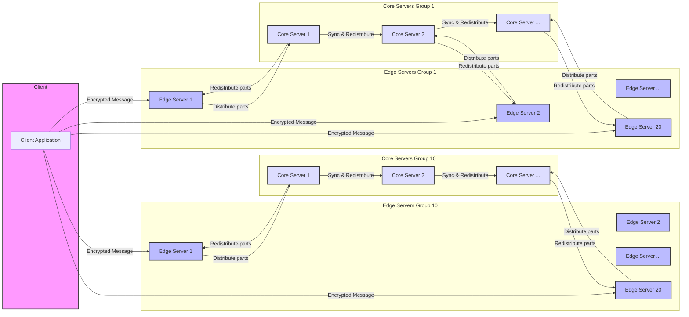

# enc-chat

This project aims to develop a highly secure, distributed, end-to-end encrypted chat system that supports both individual and group communications. The system prioritizes privacy, security, and anonymity by employing advanced cryptographic techniques, consistent message sizes, double encryption, and a network of in-memory, read-only servers. It is designed to be resistant to tracking and surveillance, ensuring that users' communications remain confidential and secure.

## Key Features

- End-to-End Encryption: Utilizes robust encryption methods to ensure messages are readable only by the intended recipient(s), securing communications from potential eavesdroppers.
- Consistent Message Sizes: Standardizes the size of all messages to combat traffic analysis attacks, making it more challenging to infer information based on packet sizes.
- Message Splitting and Double Encryption: Messages are first encrypted, split into equal-sized parts, and then each part is encrypted again with a second key, enhancing security.
- Distributed, Read-Only Servers: Employs a network of servers that operate entirely in-memory, without persisting data to disk, minimizing the risk of data leaks and enhancing performance.
- Dynamic Key Management: Implements a comprehensive key management system that supports key rotation, versioning, and expiry, accommodating both individual and group chat dynamics.
- Synchronized Communication: Leverages synchronized transmissions to obscure traffic patterns, further protecting against analysis and tracking.

## Limitations

- Because of the double encryption, message splitting and synchronized communication, the system will have a constant stream of data. This will increase the latency of the communication.
- The system will not be able to handle large files. The system is designed to handle only text messages.
- The system will not be able to handle real-time communication. The system is designed to handle only asynchronous communication.
- The system will be able to handle only a limited number of users on each edge server. This is because of the constant stream of data and the double encryption.
- Since the key management system supports key rotation, versioning, and expiry, the system will only store messages for a limited time. This will make it impossible to retrieve old messages.

## System Components

1. Client Application: Handles encryption, message padding, splitting, and reassembly, manages key exchanges, and facilitates communication with the server network.
2. Edge Servers: Serve as the network's entry and exit points, managing the initial reception and final distribution of message parts to and from clients.
3. Core Servers: Act as the system's backbone, facilitating the redistribution of message parts among edge servers to ensure redundancy and data availability.
4. Encryption and Key Management: Incorporates public/private and symmetric key cryptography for securing messages and managing keys efficiently across both individual and group chats.

## Implementation Strategy

### Individual Chats

- Encryption: Messages are encrypted using a recipient-specific public key, padded to a uniform size, split, and then each part is encrypted again before transmission.
- Key Management: Employs regular key rotation and versioning, with keys being distributed securely among clients and servers.

### Group Chats

- Group Key Distribution: Utilizes asymmetric encryption to distribute a shared symmetric key to group members, ensuring that only members can decrypt group messages.
- Message Encryption: Group messages are encrypted with the shared symmetric key, then signed with the sender's private key to provide authenticity and integrity.
- Digital Signatures: Each message is signed by the sender, allowing recipients to verify the message's origin and ensuring it has not been altered.
- Dynamic Group Management: Supports adding/removing members by updating the shared symmetric key and redistributing it to current members, ensuring past messages remain secure and inaccessible to new members or those who have left the group.

## Security Considerations

- Double Encryption and Message Splitting: Enhances message security and minimizes the risk of unauthorized decryption.
- In-Memory, Read-Only Operation: Servers operate without writing data to disk, significantly reducing the risk of data breaches.
- Synchronization and Anonymity: Synchronized message transmissions and uniformly sized packets help protect user anonymity and prevent traffic analysis.

## Communication Protocol

By split the message into equal-sized parts, encrypting each part twice, and distributing them across the server network, the system ensures that no single entity can access the complete message. The communication protocol is designed to be resistant to traffic analysis and surveillance, providing a high level of privacy and security.

### Network Architecture

Here ar the concepts of the network architecture. The network architecture is designed to be resistant to tracking and surveillance, ensuring that users' communications remain confidential and secure.

One server group:

### Server Network

The server network consists of edge servers and core servers. The edge servers serve as the entry and exit points for the network, while the core servers act as the backbone, ensuring message redundancy and data availability. The servers operate in-memory and do not persist data to disk, minimizing the risk of data leaks and enhancing performance.

The servers will be grouped in to 10 separated systems. And these will not be connected to each other. This will make it impossible to get the complete message by hacking one server group.

#### Edge Servers

The edge servers are responsible for receiving and distributing message parts to and from the clients. They also manage the initial encryption and final decryption of the message parts, ensuring that only the intended recipient(s) can access the message.

#### Core Servers

The core servers facilitate the redistribution of message parts among the edge servers, ensuring redundancy and data availability. They also manage the key distribution and versioning, supporting both individual and group chat dynamics.

### Certificate Management

GPG like certificate management is used to manage the public and private keys of the users. The public keys are distributed to the servers and the private keys are stored in the client application.

By using a public key infrastructure, the system can ensure that only the intended recipient(s) can decrypt the message parts. The system also supports key rotation and versioning to enhance security and manage key distribution efficiently.

### Identification and Authentication

By assigning a unique identifier to each user, the system can send the correct message parts to the intended recipient(s) without revealing the recipient's identity to the servers. The system also supports digital signatures to verify the authenticity and integrity of messages.

### CRC and Message Integrity

Since we split the message into equal-sized parts, we can use CRC to verify the integrity of the message parts. This ensures that the message parts have not been tampered with during transmission.

### Synchronized Communication

Synchronized transmissions are used to obscure traffic patterns and protect against analysis and tracking. This helps to ensure that the system is resistant to surveillance and tracking, providing a high level of privacy and security.

### Keys

The system uses a combination of public/private and symmetric key cryptography to secure messages and manage keys efficiently. The public/private keys are used for encryption and decryption, while the symmetric keys are used for group chats and key distribution.

#### Key 1 - Message Encryption

The first key is used to encrypt the message parts before transmission. This key is unique to the recipient and is distributed securely to the servers.

#### Key 2 - Message Splitting

The second key is used to encrypt each part of the message before transmission. This key is unique to the message and is distributed securely to the servers.

### Client to Server Authentication

1. Client connects to at least 20 edge servers in 10 different server groups.
   1. Send its ID and public key 2 to the servers over a HTTPS connection.
   2. Server verifies the public key 2 and stores the ID and public key 2 in its memory database.
   3. Server sends a response to the client.
   4. Client verifies the response and stores the server's public key 1 in its memory database.

Now the client and server are authenticated to each other. and start the communication. All communication are synchronized to obscure traffic patterns and protect against analysis and tracking. There for the communication will have a constant stream of data.

### Communication sequence

After a client is authenticated to the server, the client will start the communication. There is always the client thats request the communication and the server that responds to the request. And this will is done synchronously.

### Message Transmission

1. A message is first encrypted with the recipient's public key, then split into equal-sized parts, and each part is encrypted again with a second key.
2. Wait for the next synchronization point.
3. Then it is send to 20 edge servers in 10 different server groups.
4. The edge servers then distribute the message parts to the core servers.
5. The core servers redistribute the message parts among the edge servers to ensure redundancy and data availability.

### Message Reception

1. The client sends a request to the server to receive the message for ID. This is encrypted with the server's public key
2. The server then sends the message parts to the client. This is already encrypted with the client's public key 2. and will not be decrypted by the server.
3. Client receives the message parts and decrypts them with its private key 2. Then assembles the message and decrypts it with private key 1.

## Conclusion

This comprehensive chat system project outlines a secure, distributed approach to implementing end-to-end encrypted communications for both individual and group settings. By combining advanced cryptographic techniques with a unique network architecture, the system provides a robust platform for secure, private, and anonymous digital communications.
